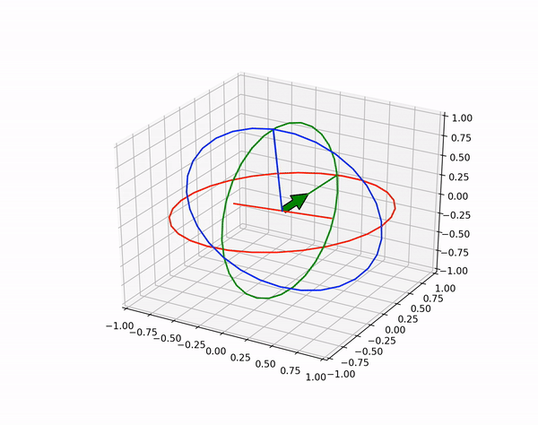
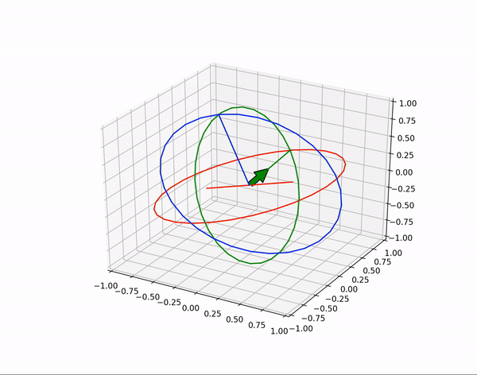

# BNO055_orientation_viz

  
   

1. make a virtualenv and activate it
	`$ virtualenv -p python3 /<path-to-venv>/BNO_ENV`
	`$ source /<path-to-venv>/BNO_ENV/bin/activate`
2. Install dependancies
	`$ pip install -r requirements.txt`
3. add project root to python path
	`$ cd /<path-to-project-root>/eulerscope`
	`$ export PYTHONPATH=$PYTHONPATH:. `
4. run e.g.  
	`$ cat example.log | python eulerscope/main.py`

Run interactive (with roll, pitch, yaw values entered in the terminal manually)
	`$ python eulerscope/main.py`
